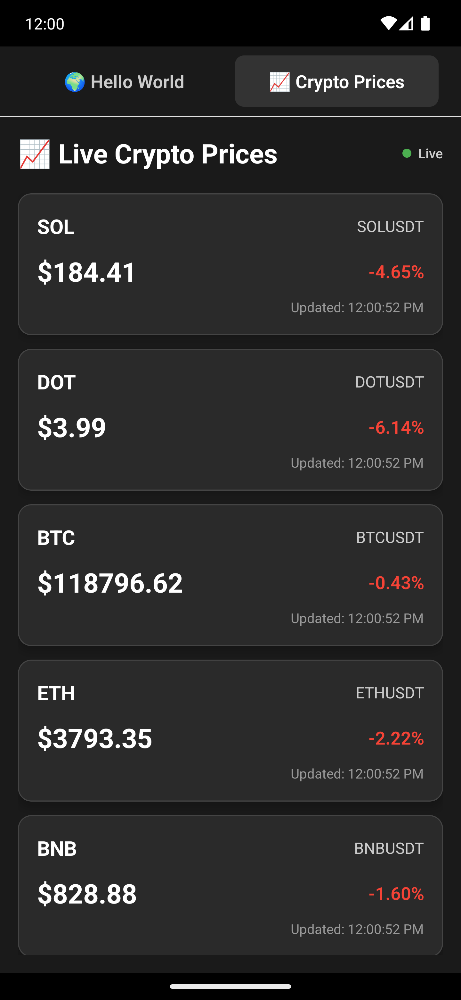

# showcase_react_native_crypto
React Native application built without Expo, featuring live cryptocurrency prices via WebSocket API

## Features
The app now includes a live crypto price display that:
- Connects to Binance WebSocket API (free and reliable)
- Shows real-time prices for popular cryptocurrencies (BTC, ETH, BNB, ADA, SOL)
- Displays price changes with color coding (green for positive, red for negative)
- Auto-reconnects if connection is lost
- Updates prices in real-time

## App Screenshots & Demo

### App Interface

<div align="center">
  
  
</div>

### Loading & API Connection

<div align="center">
  
</div>

### App Demo Video

<div align="center">
  
</div>

## Prerequisites

Before running this app, make sure you have the following installed:

### For iOS Development:
- **Node.js** (version 18 or higher)
- **Xcode** (latest version from App Store)
- **CocoaPods** (`sudo gem install cocoapods`)
- **iOS Simulator** (comes with Xcode)

### For Android Development:
- **Node.js** (version 18 or higher)
- **Java Development Kit (JDK)** (version 11 or higher)
- **Android Studio**
- **Android SDK**
- **Android Emulator** or physical Android device


## Project Structure

```
showcase_react_native_crypto/
├── App.tsx                    # Main application component with tabs
├── components/
│   └── CryptoPrice.tsx       # Crypto price display component
├── config/
│   └── CryptoAPIConfig.tsx    # Crypto API Config
│   └── CryptoUIConfig.tsx     # Crypto UI Config
├── index.js                   # Entry point
├── package.json               # Dependencies and scripts
├── ios/                       # iOS native code
├── android/                   # Android native code
├── __tests__/                 # Test files
└── README.md                 # This file
```

## Available Scripts

- `npm start` - Start the Metro bundler
- `npm run ios` - Run the app on iOS simulator
- `npm run android` - Run the app on Android emulator/device
- `npm test` - Run tests


## WebSocket API Details

The crypto price feature uses:
- **API**: Binance WebSocket Stream
- **Endpoint**: `wss://stream.binance.com:9443/ws/!ticker@arr`
- **Data**: Real-time ticker data for all trading pairs
- **Filtering**: Shows only popular cryptocurrencies (BTC, ETH, BNB, ADA, SOL)
- **Updates**: Real-time price changes and percentages
- **Reconnection**: Automatic reconnection every 5 seconds on disconnect


## Learn More

- [React Native Documentation](https://reactnative.dev/)
- [React Native CLI](https://github.com/react-native-community/cli)
- [TypeScript with React Native](https://reactnative.dev/docs/typescript)
- [Binance WebSocket API](https://binance-docs.github.io/apidocs/spot/en/#websocket-market-streams)
